# Corso shell bash

<!-- MarkdownTOC autolink="true" -->

- [Introduzione](#introduzione)
- [Mostrare i file imparando a scoprire opzioni e parametri dei vari comandi](#mostrare-i-file-imparando-a-scoprire-opzioni-e-parametri-dei-vari-comandi)
- [Scopriamo i vari modi di creare un file da linea di comando e come leggerne il contenuto](#scopriamo-i-vari-modi-di-creare-un-file-da-linea-di-comando-e-come-leggerne-il-contenuto)
- [Gestiamo le cartelle e muoviamoci al loro interno](#gestiamo-le-cartelle-e-muoviamoci-al-loro-interno)
- [Copiamo, spostiamo, rinominiamo e rimuoviamo file e cartelle](#copiamo-spostiamo-rinominiamo-e-rimuoviamo-file-e-cartelle)
- [Gli utenti e i permessi](#gli-utenti-e-i-permessi)
- [I programmi, le shortcut e il gestore pacchetti](#i-programmi-le-shortcut-e-il-gestore-pacchetti)

<!-- /MarkdownTOC -->

## Introduzione

Perché è importante conoscere questo strumento e di cosa si tratta realmente?

La shell, spesso chiamata terminale,CLI (Command Line Interface) o bash, non è altro che una interfaccia verso il vostro sistema operativo di riferimento. Ne esistono di diversi tipi ma la più comune e quella più diffusa nei sistemi *unix-like* come Linux o OSX (Mac) è sicuramente la Bash che la fa da padrone ormai da più di 25 anni!

Se vi state chiedendo come mai abbiamo ancora bisogno di imparare a padroneggiare uno strumento così vecchio, beh, rigirate la domanda e chiedetevi quanto possa essere potente e utile per aver resistito così tanto sulla cresta dell'onda. Nonostante la sua veneranda età, vi permetterà di padroneggiare il vostro sistema operativo, i programmi in esso installati e ogni tipo di operazione che vorrete svolgere su file, cartelle, utenti e permessi oltre a essere anche un potente linguaggio di scripting comodo per automatizzare processi e operazioni routinarie.

Bash non è di certo l'unica shell disponibile ma è sicuramente quella che troverete installata in qualsiasi hosting e server degno di questo nome. Anche il cloud computing, che fa largo uso di sistemi unix, richiede la conoscenza di questo tool per poter essere capito e sfruttato a dovere. Pensate che Amazon Web Service, IBM su Bluemix e, più di recente, anche Microsoft su Azure hanno sviluppato dele distribuzioni Linux pensate proprio per i loro cloud che prevedono l'interazione completa via SSH, uno dei punti di maggiore forza delle shell bash.

Ora che abbiamo capito che ci tornerà utile conoscere questo strumento andiamo a vedere come è fatto nella sua forma tradizionale, quella che trovate di default installata in Ubuntu, Fedora, Debian, Mac e molti altri sistemi operativi basati su GNU/Linux o Unix.

La prima cosa che notiamo lanciando il terminale è che c'è il nostro nome, seguito da una chiocciola e dal nome del nostro PC. Questo è il modo che ha la shell di indicarci con quale user siamo loggati e su che macchina stiamo operando in questo preciso momento. Perché sono così importanti queste informazioni lo capiremo più avanti, quando vi introdurrò il concetto di *connessione remota via SSH*. Per ora teniamoci questa informazione e passiamo all'elemento successivo, quel simbolo `~` che vedete subito dopo la macchina. In quella porzione di shell viene indicata la posizione nella quale ci troviamo e la tilde (il nome ufficiale di quello strano simbolo matematico) rappresenta la cartella `home` del nostro utente.

L'ultimo elemento che vediamo è un simbolo, solitamente se non avete lanciato comandi particolari dovrebbe essere un dollaro, che rappresenta il livello di permessi con il quale stiamo lanciando comandi. quando trovate il `$` sapete che state eseguendo comandi con i permessi standard del vostro utente mentre se vedete un `#` state operando con i permessi di Amministratore (che in unix chiamiamo **Super User** o **root**).

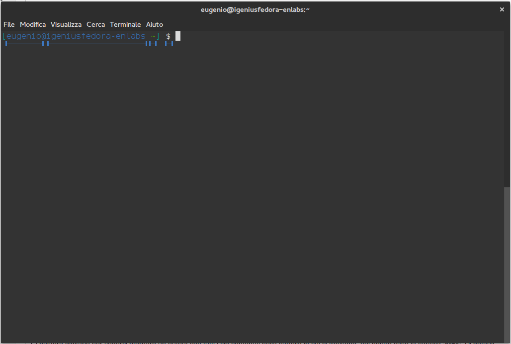

Abbiamo quindi capito che tramite il terminale possiamo sia lanciare i nostri programmi oppure spostarci tra le cartelle e possiamo anche operare modifiche sui file, cerchiamo quindi nel prossimo capitolo di capire come funziona e quali sono i comandi fondamentali da imparare e ricordare.

## Mostrare i file imparando a scoprire opzioni e parametri dei vari comandi

Ora che abbiamo avviato il nostro terminale e abbiamo capito che non è poi una cosa così esotica e pericolosa, nonostante ci siano delle inquietanti scritte bianche su sfondo nero, passiamo all'azione!

Il primo programma che andremo a scoprire è il comando `ls` ovvero *list*, che serve a mostrarci i file nella cartella corrente.

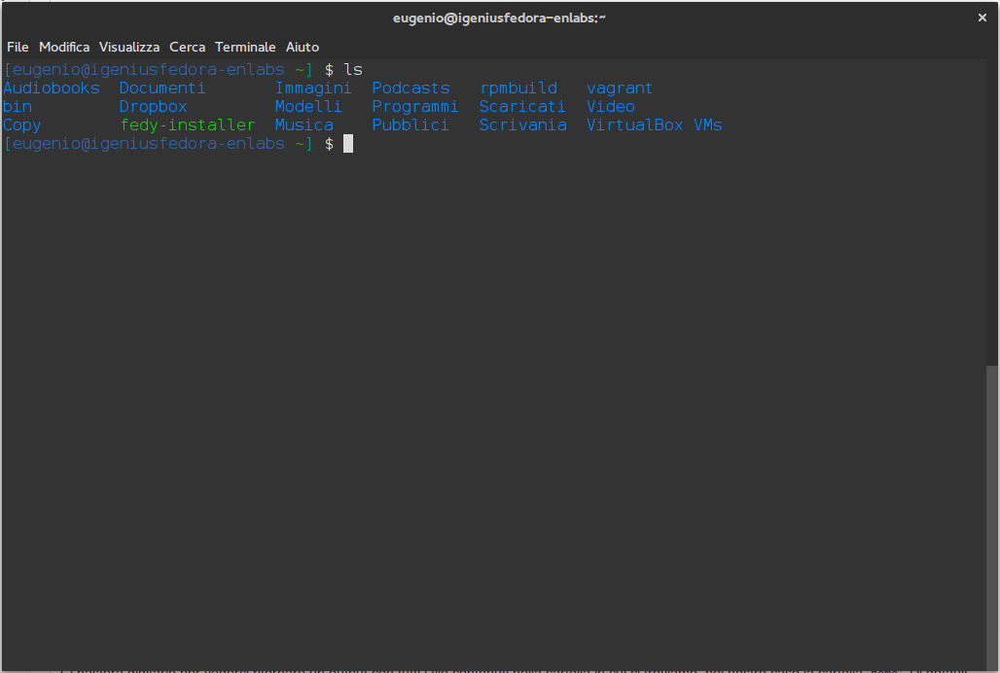

Ci basterà digitarlo per vederci ritornare un output con tutti i file contenuti nella cartella in cui ci troviamo, nel nostro caso la cartella `home`. Di default però il comando ls non mostra i file nascosti, proprio come fa il file manager grafico, dovremo aggiungere qualche parametro al comando stesso. Quello preposto per mostrarci tutti i file è il parametro `-a` o `--all`.

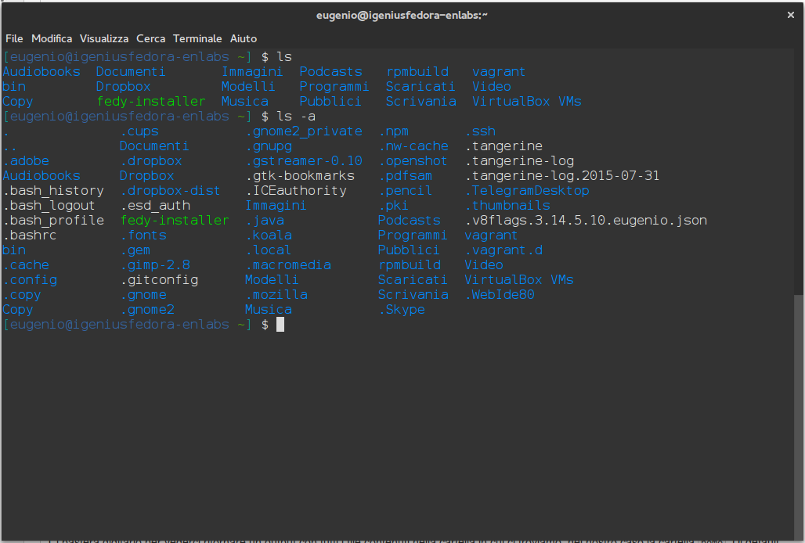

Il terminale per indicarci che un file è nascosto di default ci mette un punto davanti e questa è una convenzione piuttosto diffusa ormai e che resta valida anche per i programmi FTP (come filezilla) e su quasi tutti i pannelli online per la gestione dei file nei server.

Come possiamo notare abbiamo passato ulteriori informazioni ad un comando base, ma come ho fatto a scoprire questo parametro? Di certo avrei potuto chiamare in causa il comando `man` facendolo seguire dal programma di cui mi interessava il manuale, quindi nel mio caso `man ls`, ma poi mi sarei dovuto sorbire la lettura di intere paginate a video e avrei avuto così tante informazioni da filtrare che mi avrebbero portato via un intero pomeriggio. Il comando `man` infatti serve a spiegare nel dettaglio tutto quello che c'è dietro a un programma o a un comando senza tralasciare nulla, neanche la licenza d'uso. Quando vogliamo capire semplicemente la sintassi e i parametri/opzioni di un comando come facciamo?

In moltissimi casi, sopratutto con i comandi più usati, abbiamo un parametro che ci spiega sinteticamente tutto quello che c'è bisogno di sapere, questo è il parametro `--help`. Nel caso di `ls --help` e di molti altri otteniamo un riassunto dell'ordine e della sintassi in cui i parametri e le opzioni vanno concatenate al comando base e poco più sotto, tutti i parametri disponibili e le varie opzioni più frequenti e utili.

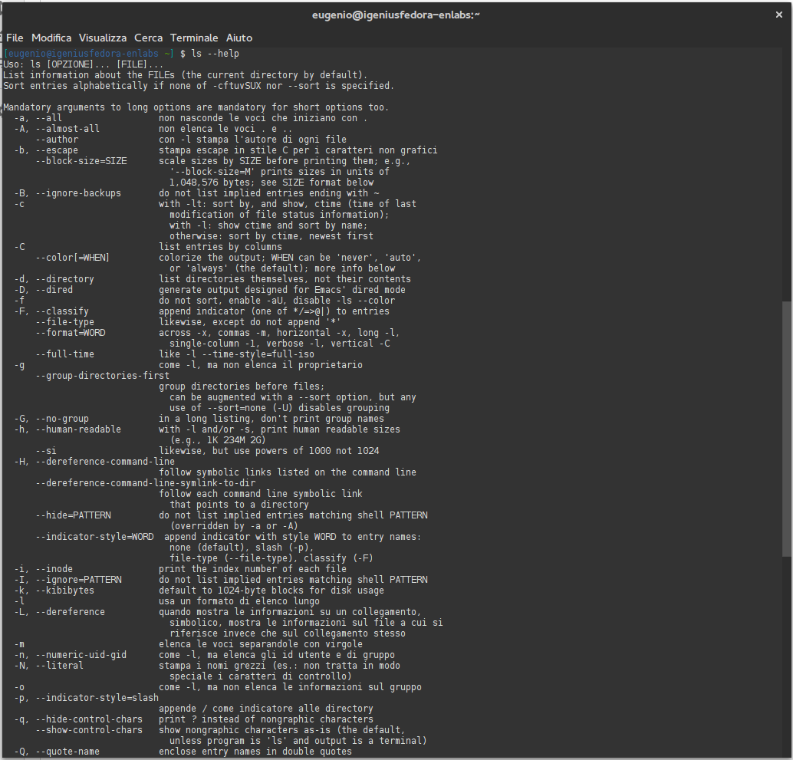

Ora che sappiamo come cercarci i parametri per i nostri comandi possiamo passare al prossimo capitolo con una marcia in più e andare ad approfondire l'uso del terminale in maniera più utile e costruttiva della semplice lista di file contenuti in home, ma prima vi lascio qualche quiz con cui cimentarvi per passare a pieni voti questa lezione.

## Scopriamo i vari modi di creare un file da linea di comando e come leggerne il contenuto

In questa lezione impareremo a creare un file da riga di comando in varie maniere, questo perché non c'è una vera e propria modalità standard in cui farlo. In effetti potreste anche usare il terminale per richiamare il vostro text-editor preferito e usare una interfaccia grafica, o farlo con vim o nano, i due editor di testo integrati in quasi tutti i sistemi operativi di default ma sarebbe comunque un'operazione che richiede più passaggi e magari vogliamo semplicemente inserire 1 sola riga che con una istruzione sarebbe più comodo passarla dalla stessa shell in cui dobbiamo poi operare per altre cose legate al task che stiamo svolgendo.

Ma passiamo alla pratica, che ci piace molto più della teoria!

Il primo comando che voglio trasmettervi è il comando `touch nome-file` che non farà altro che andare a modificare il timestamp del file su cui lo lanciamo e nel caso non vi sia nessun file con quel nome ce ne inizializzerà uno vuoto. Cos'è il timestamp di un file?
È quel metadato che ogni file di un sistema operativo ha al suo interno, che serve a indicare la data e l'ora dell'ultima modifica operata.
Facciamo un esempio pratico, apriamo la nostra console e digitiamo `touch test.txt` poi proviamo a digitare `ls -l` e leggiamo la data e l'ora dell'ultima modifica del file test.txt. Noteremo subito che corrisponde esattamente alla data di creazione del file, perché il file non esisteva in precedenza. Ora aspettiamo qualche secondo e ripetiamo il comando (nelle moderne shell ci basterà premere il tasto freccia su o giù per scorrere nello storico dei comandi utilizzati in precedenza senza dover digitare nuovamente da zero il comando). Ora possiamo notare che ripetendo anche `ls -l` ci troviamo di fronte all'ora modificata. Questo comando è utile, quindi, non solo per creare file vuoti da zero ma anche per cambiarne l'ora e il giorno dell'ultima modifica senza troppo sforzo e senza passare da una GUI (Graphic User Interface o Interfaccia Grafica).

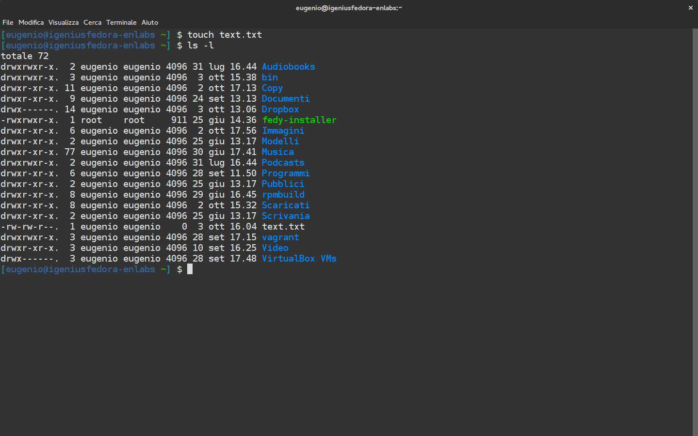

Ma se volessimo invece stampare qualcosa già nel file di output?
La cosa è più semplice di quanto pensiate, ci basterà infatti usare un comando che stampa del testo a video e un filtro.
Stiamo correndo troppo? Ok, partiamo dal comando `echo` che si trova anche in molti linguaggi di programmazione e che serve appunto a stampare a video un determinato testo o il risultato di una serie di operazioni.

Proviamo a digitare `echo 'skillsAndMore'` nel nostro terminale e vedremo immediatamente che il terminale ci riproporrà quello che abbiamo riportato tra singoli apici. Per ora nulla di troppo utile ma se consideriamo che questo è solo un comando per pilotare un output iniziamo a capire le potenzialità della cosa. Proviamo ad esempio a digitare `echo '1+1'`, quello che ci aspettiamo è di ricevere la somma di questi due numeri ma in realtà vederemo che a tornarci sarà la mera rappresentazione grafica di 1+1 perché il comando va istruito e finchè non specifichiamo che deve eseguire una operazione matematica prima di stampare il risultato lui la interpreterà sempre come una semplice stringa di testo. Vediamo ora il modo giusto di fargli eseguire dei calcoli: `echo $((1+1))`. Il risultato stampato a video sarà ovviamente 2.

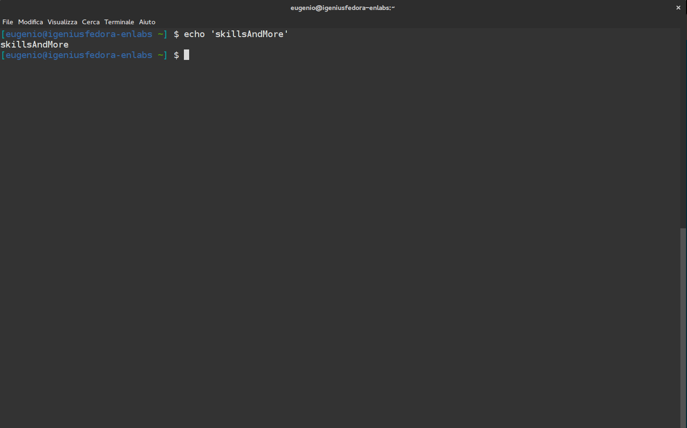

Abbiamo usato un operatore matematico per raggiugnere uno scopo diverso da quello di stampare una stringa ma come possiamo usare il comando echo per scrivere **dentro** un file?

Doabbiamo *filtrare l'outuput* del comando reindirizzandolo nel file. Tranquillo non è così difficile come sembra a parole, ci basta un semplice carattere che fà questo al posto nostro, una parentesi angolare acuta o per farla più semplice `>`.

Proviamo a scrivere skillsAndMore nel file test.txt reindirizzandoci l'outuput in questo modo: `echo 'skillsAndMore' > test.txt`

Fatto questo proviamo ad aprire il nostro file e noteremo che skillsAndMore è stato scritto al suo interno.
Aggiungiamo a questa lezione anche un comando molto utile, che serve appunto per leggere cosa c'è scritto dentro un file senza doverlo aprire in un editor di testo esterno, perché la shell è capace anche di questo!

Digitiamo il comando `cat test.txt` e ci verrà restituito l'output `skillsAndMore` contenuto al suo interno. Il comando `cat` è uno di quei comandi che troverete spesso in giro per la rete e che vi consentirà ad esempio di leggere parametri all'interno di un file di configurazione oppure di unire due o più file in uno unico. Come si fa? Semplice, applichiamo il concetto di *pipe* appreso in precedenza anche a questo comando ma prima creiamo un nuovo file di testo che chiameremo test2.txt con all'interno altro testo: `echo 'la scuola del digitale' > test2.txt` poi assicuriamoci del suo contenuto richiamando il comando `cat` sul file appena creato e passiamo ad unire i due file concatenandoli con `cat test.txt test2.txt > test3.txt` e il risultato della operazione sarà un file che contiene entrambe i testi contenuti nei due file. Semplice e diretto, non credi?

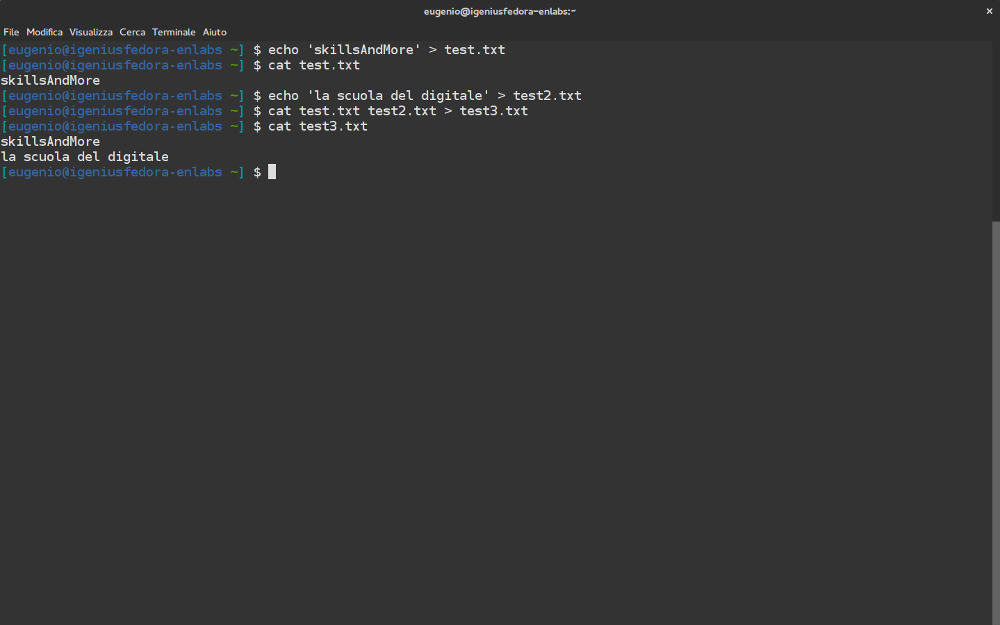

Passiamo ora a qualche test pratico prima di proseguire al prossimo capitolo.

## Gestiamo le cartelle e muoviamoci al loro interno

Fino a ora abbiamo parlato di file ma sappiamo bene che un sistema operativo è organizzato per cartelle quindi iniziamo a capire cosa sono e come crearle.

Una cartella non è un file e quindi non può essere trattata allo stesso modo. Non possiamo ad esempio crearla con il compando `touch` e non possiamo scrivere nulla dentro di lei direttamente con `echo` ma dobbiamo usare l'apposito comando `mkdir`.

Creare la nostra cartella in cui raggruppare i file della lezione precedente è facilissimo, ci basterà un `mkdir skillsandmore`. Una volta creata la cartella possiamo iniziare a capire come muoverci al suo interno.

Il comando per spostarci da una posizione a un'altra è `cd`, ovvero change directory, e basta farlo seguire dalla posizione della cartella in cu vogliamo spostarci per raggiungere il risultato. Nel nostro caso ci basterà dare `cd skillsandmore`, ricordiamoci sempre che c'è il tasto TAB che ci aiuta spesso nell'autocompletamento sia quando non ci va di scrivere i nomi lunghi, sia quando non ci ricordiamo bene l'intera posizione.

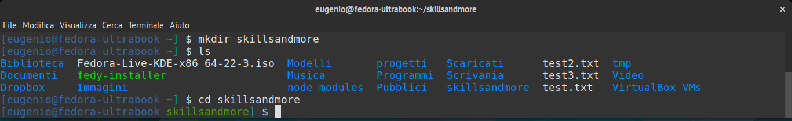

Ci basterà digitare `cd ..` per scendere di una posizione nell'albero delle cartelle.

Solitamente un sistema operativo parte da una cartella radice, che si chiama appunto **root** e che è rappresentata come lo slash iniziale delle posizioni **/**. In questa cartella ci sono tutti i file di sistema che solitamente richiedono permessi speciali per interagirci in maniera attiva. Si può risalire, a seconda dei vostri permessi, fino alla cartella root usando il comando `cd /` ma solitamente ogni utente ha come punto d'inizio dei percorsi la propria cartella **home** e infatti noterete che in qualsiasi posizione ci troviamo richiamando il semplice comando `cd` senza nulla a seguito verremo riportati direttamente in quella cartella. La cartella home è una cartella speciale e ogni utente del sistema ne avrà una che si troverà in `/home/nome_utente`.

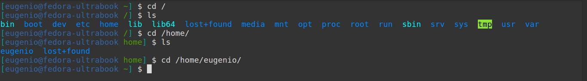

Per accedere direttamente a una cartella che si trova all'interno della posizione in cui siamo attualmente ci basterà scrivere il nome della cartella dopo il comando `cd`, come abbiamo visto prima nel caso della cartella `skillsandmore` ma per accedere a una cartella fuori percorso?
Niente di più facile, infatti ci basta conoscere il path per usare sempre `cd` come abbiamo fatto fino a ora.

Accediamo per esempio alla cartella `Documenti` all'interno della nostra home digitando semplicemente `cd /home/eugenio/Documenti`. Ricordiamoci sempre di aiutarci con l'autocompletamento (TAB) e del fatto che i sistemi unix-like sono **case sensitive**, ovvero riconoscono le differenze tra lettere maiuscole e minuscole.

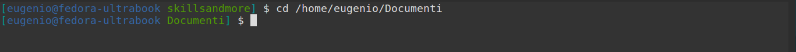

Prima di lasciarvi al quiz di fine lezione voglio aggiungere una piccola cosa che vi aiuterà a risparmiare tempo. Ora ci troviamo nella cartella *Documenti* e vogliamo tornare nella cartella *skillsandmore*, potremo fare come prima e scrivere tutto il percorso che conosciamo a partire dalla root, passando per la home, il nostro nome utente e poi la nostra cartella, ma è tantissima roba e se il percorso fosse ancora più lungo e intricato? In fondo queste due cartelle condividono la *loro radice* quindi basta dire al terminale di tornare indietro e di entrare nell'altra! Per fare questo ci basta usare i due puntini di prima, come il comando `cd` li accetta da soli, li prende anche accoppiati ad un percorso.

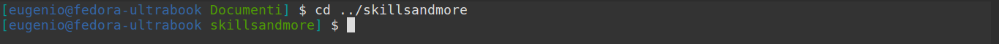

## Copiamo, spostiamo, rinominiamo e rimuoviamo file e cartelle

Ora che sappiamo come muoverci all'interno delle cartelle iniziamo a capire come spostare i file da un posto ad un altro. Il comando che si usa per fare questo è `mv`, *move*, seguito dal percorso del file da spostare e dal percorso in cui vogliamo mandarlo.

Mettiamo caso di voler spostare il nostro file *test.txt* nella cartella *skillsandmore*, ci basterà digitare `mv test.txt skillsandmore`. Ma mettiamo caso di voler spostare anche *test2.txt* e *test3.txt* nella stessa cartella con un comando solo, allora ci basterà rigirare lo schema e usare l'opzione `-t` in questo modo `mv -t skillsandmore/ test2.txt test3.txt`, con la cartella di destinazione che precede la lista di file da spostare.

Ricordiamoci sempre che con i puntini seguiti dallo slash possiamo indicare al terminale la cartella subito precedente a quella in cui siamo, quindi se volessimo spostare indietro i file ci basterebbe dare un bel `mv test.txt ../`.

In questo caso avremmo anche potuto usare una *wildcard* perché i file che dovevamo spostare avevano tutti più di una cosa in comune, l'estensione txt e la parola test. Una wildcard ci permette di impostare un set di caratteri *jolly* per selezionare o meno un file o una cartella. Vi faccio un esempio pratico così capiamo meglio.

Posizioniamoci nella nostra cartella dove abbiamo spostato i file e digitiamo: `mv *.txt ../`, possiamo notare ora che tutti i file con estensione txt sono stati spostati nella cartella superiore.

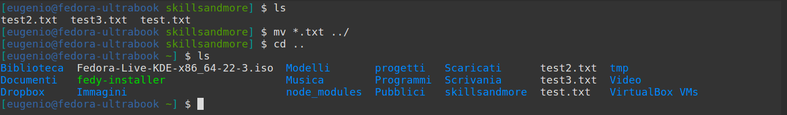

Proviamo ora a spostarli selezionandoli per l'occorrenza *test*, `mv *test* skillsandmore`, e vediamo che avendolo messo tra asterischi lui non ha fatto altro che cercare tutti i file che contenevano quella wildcard per applicargli il comando da noi desiderato. Ovviamente il concetto di wildcard resta valido per quasi la totalità dei comandi unix.

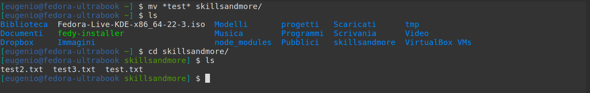

Il comando `mv` ci torna utile anche per rinominare i file, infatti se specifichiamo un nuovo nome per il file lo spostamento avverrà rinominandolo e se non vogliamo spostarlo ci basterà semplicemente usare `mv` nella stessa cartella in cui si vuole operare. Guardate come ho rinominato il file *test.txt* in *test1.txt* usando solo `mv test.txt test1.txt`, facile no?

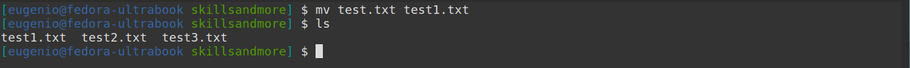

E se invece di spostare un file vogliamo copiarlo ci basterà sostituire tutto quello che abbiamo imparato di `mv` con il comando `cp`, ovvero *copy*. Per copiare *test.txt* ci basterà dare ad esempio `cp test1.txt ../`.

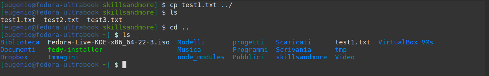

Ovviamente potrete specificare un nome alternativo per il file se volete rinominarlo durante la copia, per esempio `cp test1.txt ../test-rinominato.txt` copierà nella posizione superiore un file di nome *test-rinomnato.txt* del tutto identico al file originale ma con un timestamp diverso.

Ora vediamo come rimuovere il file appena copiato e rinominato. Per farlo ci avvarremo del comando `rm`, *remove*, che ci permette di specificare semplicemente il percorso del file da rimuovere per eliminarlo definitivamente. Proviamo a dare un bel `rm test-rinominato.txt` posizionandoci nella cartella home in cui avevamo il file.

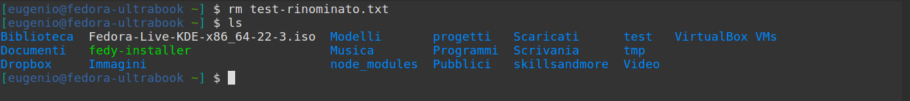

Ora che sappiamo come operare sui file vediamo come usare questi stessi comandi per interagire con le cartelle che, come abbiamo visto prima, vanno trattate in maniera leggermente differente.

Per esempio se vogliamo spostarle, il comando `mv` funzionerà egregiamente con tutto quello che abbiamo visto fino a ora ma, se vogliamo copiare una cartella con all'interno tutti i suoi file dovremo prendere l'accortezza di usare un parametro in più, ovvero `cp -r`. Questo parametro serve a rendere *ricorsivo* il comando e a operare non solo sul percorso specificato ma anche su tutti i file e cartelle in esso contenuti.

Creiamo una cartella *test* all'interno della nostra *home*, sullo stesso livello della cartella *skillsandmore* e proviamo con le nostre mani a spostare la seconda che contiene i file di testo nella prima che dovrebbe essere vuota.

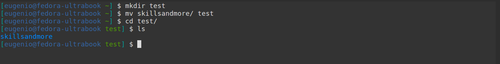

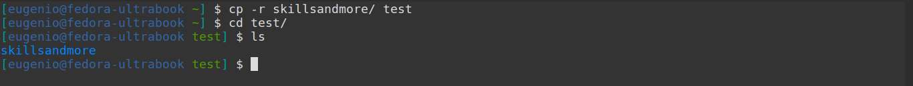

Per rimuovere una cartella ci sono due parametri di `rm` che dobbiamo assolutamente ricordare. Il primo è `rm -d` che ci permette di eliminare una cartella vuota mentre il secondo è `rm -r` che come nel caso di `cp -r` agisce ricorsivamente eliminando una cartella e tutto il suo contenuto.

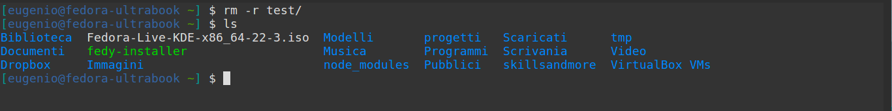

## Gli utenti e i permessi

I sistemi Unix-like hanno come punto di forza una gestione degli utenti e dei permessi molto capillare e ben congegnata. Come abbiamo accennato in precedenza c'è un **Super Utente** che è considerato l'amministratore del sistema e poi ci sono i vari utenti, nel mio caso *eugenio*, che possono accedere alle varie operazioni di **scrittura, lettura e esecuzione** sui propri file e cartelle e su quelle di tutti i gruppi di utenti a cui è stato assegnato.

Cerchiamo di andare piano e di spiegare un passo per volta con esempi pratici quello di cui parlo.

Se ora aprite il vostro terminale e vi posizionate nella cartella skillsandmore che abbiamo creato in precedenza possiamo verificare i permessi dei file in essa contenuti usando il comando `ls -l`.

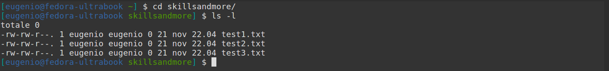

Possiamo notare come ci siano dieci caratteri prima di un numero che servono ad indicare il tipo di file e i permessi. Sono organizzati in questo modo:

- Il primissimo carattere indica la tipologia del dato e può essere un trattino (**-**) per i file, la lettera **d** per le cartelle o la lettera **l** per i link.
- Segue il primo gruppo da 3 caratteri che indica i permessi per il **proprietario**
- Il secondo gruppo indica i permessi per il **gruppo**
- Il terzo gruppo è per i permessi degli **altri** utenti al di fuori dei primi due

Cerchiamo di capire cosa indicano i tre caratteri da assegnare ai vari ruoli.

- **r** indica il permesso di leggere il file
- **w** indica il permesso di scrivere il file
- **x** indica il permesso di eseguire il file

Subito dopo seguono il nome del **proprietario** e del **gruppo**, che nel mio caso coincide con quello dell'utente eugenio.

Andiamo a vedere come cambiare questi permessi ora che abbiamo capito più o meno come funziona e scopriamo il comando `chmod` e le sue diverse sintassi.

Se volessimo subito applicare quello che abbiamo imparato fin'ora, magari assegnando tutti i permessi possibili a tutti gli utenti ci basterebbe richiamare il comando in questo modo `chmod a=rwx test1.txt` e il gioco sarebbe fatto.

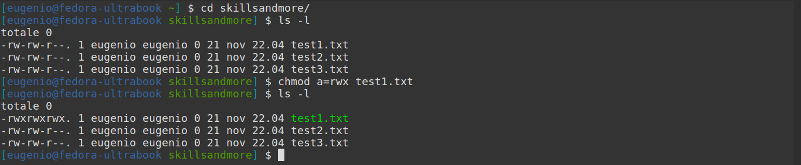

Ma andiamo ad analizzare per bene cosa abbiamo fatto e a vedere come controllare meglio tutte le regole.

Usando il parametro `a` sto dicendo di assegnare i permessi che metto dopo il segno uguale (**=**) a **tutti gli utenti**, se avessi usato il segno meno (**-**) avrei potuto eliminare un permesso e se lo avessi invece voluto aggiungere avrei potuto usare il segno più (**+**).

Ovviamente possiamo decidere di mirare solo un ruolo e raffinare meglio il nostro comando quindi andiamo a vedere le altre opzioni disponibili:

- **a**, assegna i permessi a tutti gli utenti
- **u**, assegna i permessi al proprietario
- **g**, assegna i permessi al gruppo
- **o**, assegna i permessi agli altri utenti

Proviamo ora ad assegnare i permessi in scrittura e in lettura al proprietario e al gruppo con `chmod ug=rw test1.txt`; come noterete ora il proprietario e il gruppo hanno nuovamente solo i permessi che volevamo ma gli altri hanno ancora i vecchi permessi e per toglierli dobbiamo per forza usare nuovamente un `chmod o= test1.txt`.

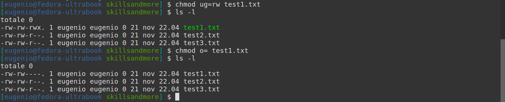

Per ovviare a questo problema e per facilitare la modifica dei permessi ci è data anche la possibilità di impostarli con un sistema ottale. Non spaventatevi perché è più facile di quanto crediate e vi semplificherà non poco la vita, permettendovi di essere sicuri di aggiornare sempre **tutti i tipi di permessi** in una volta sola, senza dimenticarne uno.

Vediamo come funziona a partire da un esempio. Proviamo ad assegnare tutti in una volta gli stessi permessi del file *test1.txt*, che abbiamo dovuto assegnare in due comandi prima, al file *test2.txt*. `chmod 660 test2.txt` farà esattamente la stessa cosa ma con un comando in meno e meno preoccupazioni di lasciare permessi liberi.

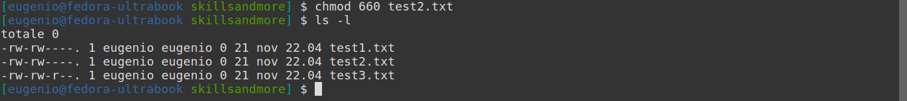

Il sistema ottale è semplicissimo, non ho tirato fuori il numero *660* a caso ma mi sono basato su una tabella. Ci basti pensare che il primo numero assegna il tipo di permesso al proprietario, il secondo al gruppo mentre il terzo agli altri utenti. Capito l'ordine applichiamo i permessi in questo modo:

- **7** equivale a **rwx**
- **6** equivale a **rw**
- **5** equivale a **rx**
- **4** equivale a **r**
- **3** equivale a **wx**
- **2** equivale a **w**
- **1** equivale a **x**
- **0** equivale a **nessun permesso**

Come noterete basterà ricordare che il valore di **r è 4**, quello di **w è 2** e quello di **x è 1**. Tutti gli altri permessi derivano dalla somma di questi tre più il permesso 0 che è il valore per annullare tutti i permessi.

Proviamo ora ad assegnare a tutta la cartella *skillsandmore* e ai file in essa contenuti tutti i permessi a tutti i ruoli. Torniamo nella cartella *home* che la contiene e diamo un `chmod -R 777 skillsandmore` e il gioco è fatto grazie al parametro `-R` che stabilisce la ricorsività dell'operazione e la va ad applicare a tutti i file all'interno della posizione specificata.

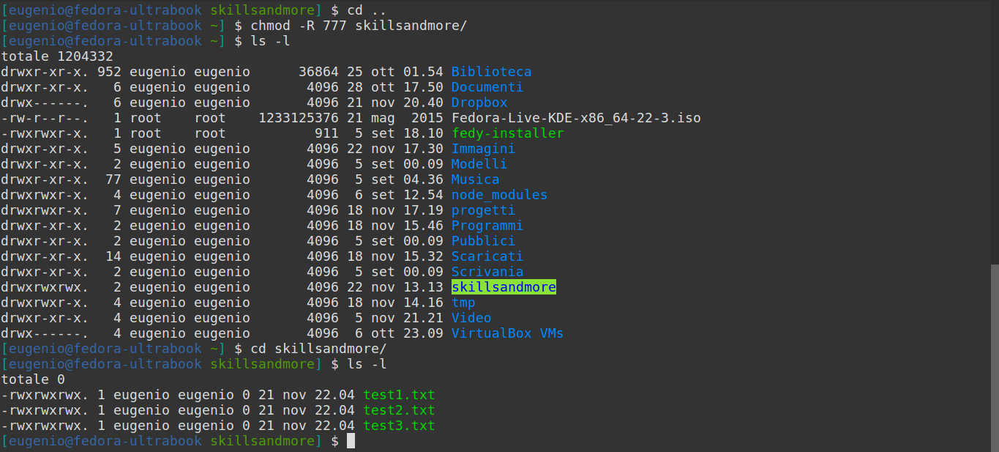

Ora che sappiamo assegnare i tipi di permessi passiamo a vedere come modificare il proprietario e il gruppo. Il comando `chown`, seguito dal nome del proprietario e/o dal nome del gruppo, è quello che fa per noi per la maggioranza delle volte. Un tipico utilizzo è `chown proprietario:gruppo test1.txt`.

Quando vogliamo solo cambiare il gruppo possiamo usare `chgrp` al suo posto in maniera analoga, senza dover specificare il proprietario.

Questi due comandi accettano ovviamente il parametro `-R` per la ricorsività dell'operazione.

Fino a ora abbiamo agito con i privilegi del nostro utente ma abbiamo visto che alcuni file potrebbero richiedere dei privilegi particolari, specialmente i file di sistema o i file di configurazione dei programmi, come facciamo ad accedervi?

Consideriamo che la maggioranza dei sistemi unix-like ha installato un programma che si chiama `sudo` e che permette di eseguire tutti i comandi con privilegi di *Super Utente*, infatti è l'abbreviazione di *"Super User Do"* che vuol dire appunto *esegui come Super Utente*.

Facendo precedere il vostro comando da `sudo` non farete altro che dire al sistema operativo di accedere a quell'operazione o a quel file con i privilegi più alti che ci siano. Per far avvenire questa "magia" dobbiamo essere sicuri che il nostro utente si trovi nel gruppo *sudo* o *sudoers*, ma solitamente questa operazione avviene in fase di installazione senza bisogno di alcuna operazione da parte dell'utente stesso.

Operare con `sudo` ci permetterà di modificare i permessi di accesso a quasi tutti i file quindi state molto attenti quando lo utilizzate perché **"da grandi poteri derivano grandi responsabilità"**.

## I programmi, le shortcut e il gestore pacchetti

Abbiamo capito che la shell è potentissima e che ha un suo linguaggio che ci permette di compiere delle operazioni e di lanciare dei programmi. Proviamo ad esempio a lanciare firefox dalla shell richiamandolo semplicemente con `firefox`.

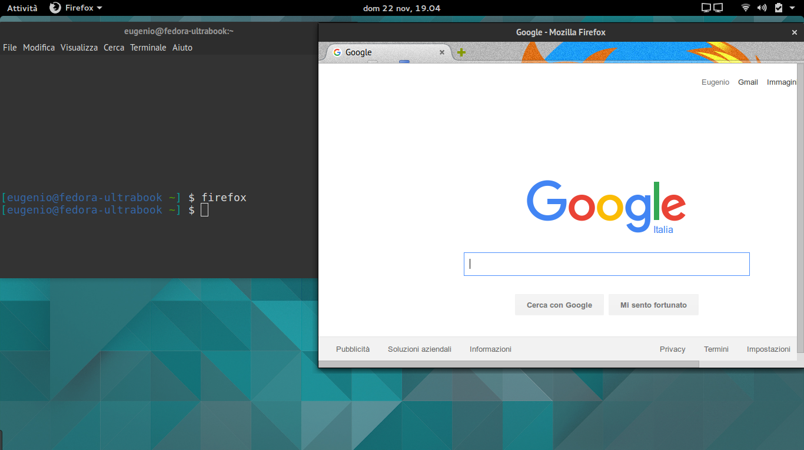

A volte noterete che inizieranno a scorrere parecchie cose sul terminale, fondamentalmente processi del programma lanciato e/o errori utili per il debug, ma il più delle volte si aprirà anche il programma stesso.

Se vogliamo lanciare un programma dalla shell e continuare a usare la stessa istanza del terminale possiamo far seguire il nome del programma dal carattere `&`, nel nostro caso `firefox &` ci permette di aprire il borwser per navigare e di continuare a usare lo stesso terminale.

Ora che abbiamo appreso questi concetti base possiamo imparare le shortcut che ci faciliteranno non di poco il lavoro.

- **ctrl + c** uccide il processo in esecuzione. Lo fa davvero in maniera brutale quindi senza curarsi di salvare alcun dato, usatelo con cura.
- **ctrl + r** permette di cercare nello storico dei comandi per parola, senza doverli scorrere tutti con i tasti freccia su o giù
- **ctrl + l** pulisce la shell da tutti i comandi precedenti, è un'alternativa al comando **clear**
- **ctrl + w** elimina l'ultima parola del comando
- **ctrl + u** elimina l'intero comando
- **alt + b** e **alt + f** ci permettono di spostarci rapidamente tra le parole del comando
- **TAB** ci permette di autocompletare sia programmi che percorsi

Ora sappiamo quasi tutto quello che ci serve del terminale ma abbiamo detto che sarebbe anche stato in grado di installare programmi aggiuntivi e per farlo ci sono diversi metodi.

Partiamo dal più classico, la compilazione dei file sorgenti.
Questa è la base dell'informatica, fondamentalemente si prende il file sorgente del programma, lo si compila con l'apposito programma (se è scritto in C o in C++ possiamo usare **gcc**) e poi prendiamo il file ottenuto e lo eseguiamo. Questo metodo è sicuramente il più scomodo perché ci richiede di controllare che abbiamo tutti i programmi necessari a compilare e far girare quel software (dipendenze) e ci richiede poi di spostare noi tutti i file generati così nelle varie cartelle del sistema operativo.

Molto spesso nei file sorgenti da compilare si trovano le istruzioni per installarlo poi sul proprio sistema in maniera semplice e le istruzioni specifiche per generare e/o usare il *makefile* che serve alla verifica e all'installazione del programma.

Ma se volessimo un metodo più comodo? Ecco qui che ci vengono incontro i package manager o gestori pacchetti che ci permetteranno di delagare tutte le operazioni a un solo file. Il formato di questo file dipende dal vostro sistema operativo e, dalla vostra distribuzione se siete in ambito linux. I pacchetti più diffusi sono .deb per Debian/Ubuntu e derivate, .rpm per RedHat/Fedora/CentOs e openSuse.

La cosa ancora più comoda dei gestori pacchetti è che vengono riforniti di programmi da *repository*, veri e propri depositi online di software che ci permettono di richiamarli da un semplice comando. Per Ubuntu e Debian c'è `apt-get` mentre per Fedora ad esempio c'è `dnf` ma il funzionamento è simile. Ad esempio se voglio installare git in fedora mi basterà dire al mio gestore `sudo dnf install git` e poi aspettare che abbia finito. Bello no?

Ma come può questo aiutarci nello sviluppo?
Pensa che esiste un packet manager per tutti i sistemi operaivi con programmi node.js che si chiama `npm` e permette con un solo comando di installare parecchi tool utilissimi per il lavoro come grunt, gulp, bower, yeoman, etc.

Ora che conoscete tutto quello che potete fare con il potere del temrinale è l'ora del quiz finale e poi dritti a divertirvi a sperimentare.